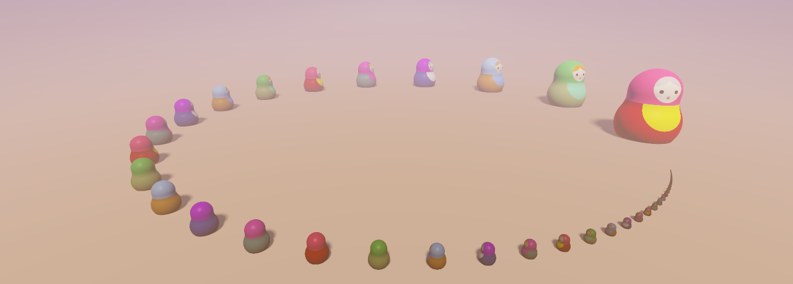

# 3D Computer Vision

This repository contains materials for the 3D Computer Vision course taught at the Faculty of Computer Science, Higher School of Economics (HSE). Slides, seminar notebooks, and assignments are in English so the materials are accessible as broadly as possible.

Lecture recordings (in Russian) are available on [YouTube](https://www.youtube.com/playlist?list=PLmA-1xX7IuzDKyFQTE5JdOxktFA62MkaS).

## Prerequisites
Linear algebra, basic probability, and familiarity with deep learning and PyTorch.

## Topics Covered
1. [Image Formation](week_01)
    - Pinhole camera model
    - Coordinates, rotations, and motion
    - Projective geometry and homogeneous coordinates
    - Image processing pipeline
2. [Multi-View Geometry](week_02)
    - The two-camera case
    - Epipolar geometry
    - High-level overview of structure from motion pipelines  
3. [2.5D Vision and Depth Prediction](week_03)
    - Cues for depth and disparity estimation
    - Depth prediction from single and multiple images
4. [Deep Learning for Multi-View Geometry](week_04)
    - Point maps
    - Transformers for multi-view geometry
    - MASt3R, DUSt3R, VGGT, Depth Anything-3, etc.
5. [Point Clouds for 3D Data Representation](week_05)
    - Equivariance and invariance in the context of deep learning architectures
    - Point cloud classification and segmentation
    - Architectures for point cloud processing
6. [Polygon Meshes for 3D Data Representation](week_06)
    - Computer graphics and inverse problems
    - Differentiable rasterization for rendering
    - Physically based rendering and the rendering equation
7. [Parametric Polygon Mesh Models for Human Bodies](week_07)
    - The SMPL model: principal components of human body shapes
    - Introduction to animation, kinematic chains, skeletons, and skinning
    - Parameter estimation methods
8. [Implicit Representations for 3D Data](week_08)
    - Density fields and volume rendering, radiance fields
    - Volume rendering via α-compositing for image synthesis from radiance fields
9. [Gaussian Splatting for Radiance Fields](week_09)
    - Scene parameterization using Gaussian splats
    - Volume rendering via rasterization-based algorithms
10. [Diffusion Models and Their Use for 3D Data](week_10) *(covered in a single, denser lecture)*
    - A brief introduction to diffusion models: intuition, training algorithms, and architectures
    - Approaches to conditional generation
    - Score Distillation Sampling (SDS) and its application to 3D generation
    - Generative models for regularizing multi-view reconstruction
    - Why 3D reconstruction is still useful when diffusion models can generate everything

## Repository Structure
- `week_01/` … `week_10/` — lecture slides and seminar notebooks for each week.
- [`assignments/`](assignments) — graded assignments with instructions.
- [`further_reading.md`](further_reading.md) — supplementary readings, videos, and tools, organized by lecture.

## How to Use This Repository
- Lecture materials are published alongside each class.
- Seminar notebooks contain hands-on exercises and examples.
- Assignments include detailed instructions and submission guidelines. 
Students are encouraged to regularly pull updates from the repository.

## Acknowledgements
- Lectures: Kirill Struminsky.
- Practical sessions: Mishan Aliev; Vladimir Zhuravlev (SMPL session).
- Teaching assistants (this year): Boris Zhukov, Amir Aflyatunov.

## License
This repository is licensed under the [Apache License 2.0](LICENSE).
